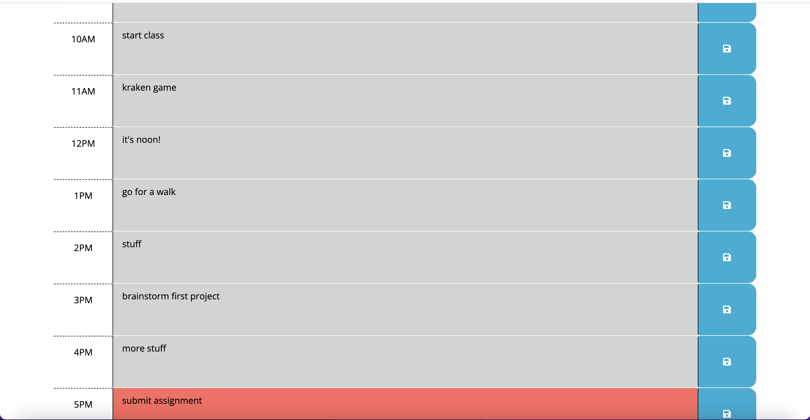

# Work-Day-Scheduler

## Description

This project allows the user to schedule their workday by the hour, and save their inputs.

## Usage

Click the following link to visit the website: https://amman98.github.io/Work-Day-Scheduler/. Click the text area next to the hour of your choosing, and input what work you plan to do that hour. Then, click the blue button on the right-hand side to save your input.

## License

Please refer to the LICENSE in the repo